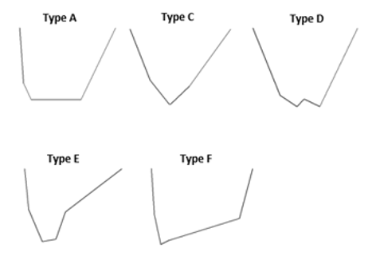
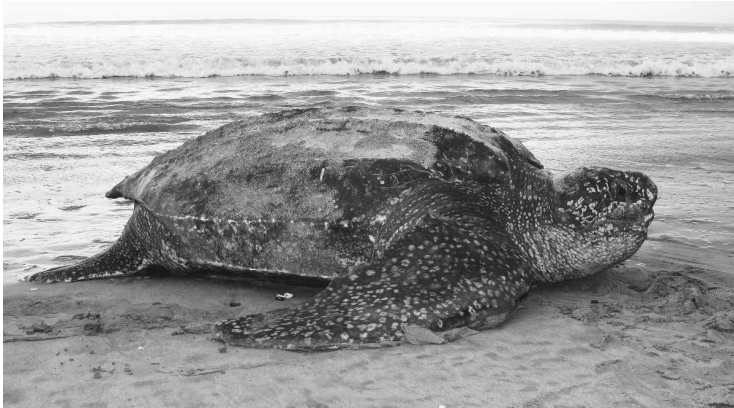
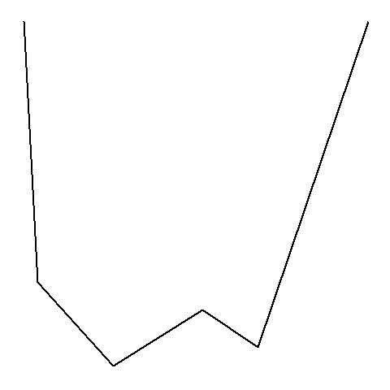

```{r setup, include=FALSE}
knitr::opts_chunk$set(echo = TRUE)
```

# **Tool From**: *Barbour et al (in review), "Clustering and classification of vertical movement profiles for ecological inference of behavior"*

<font size="4"> We developed a generalizable classification tool for sea turtle dive profiles, using an image classifier convolutional neural network (CNN) and 5 classes of known dive shapes for sea turtles (Hochscheid 2014). 

{width=50%}


<font size="4"> This tool has been fully trained using these 5 standard dive shapes (A, C, D, E, and F) known for sea turtles in combination with a dataset of dive profiles from migrating leatherback turtles in the South Pacific ocean gyre (see Shillinger et al 2008, 2011 for original data descriptions).


{width=50%}

## [Dive Classification Tool Link](https://robillarda-diveprofiler-streamlit-app-2c9i4f.streamlitapp.com/) *Click Here!*

<font size="4"> **To use**: *click the link and simply upload an image of a dive profile for a sea turtle (see example below). It will return the predicted shape class of the dive and certainty estimates. The tool can also handle large batches of dives (which is what it is intended for- to replace manual labeling of dives by their shapes!).*


{width=30%}

#### **CITE THIS TOOL AS:** *Barbour et al (in review). Clustering and classification of vertical movement profiles for ecological inference of behavior.* 

### **Contact Info**
### Nicole Barbour, *lead author*, **nbarbour@umd.edu**
### Dr. Alexander Robillard, *tool creator*, **RobillardA@si.edu**
<br>
<font size="4"> **Note:** *This tool uses sea turtle movement data that is part of the non-profit organization, [Upwell](https://www.upwell.org/)'s, efforts to conserve and research sea turtle movement ecology at sea.* 
<br>
{width=70%}
<br>
<font size="3"> **References**:
<br>
* *Shillinger, George L., Daniel M. Palacios, Helen Bailey, Steven J. Bograd, Alan M. Swithenbank, Philippe Gaspar, Bryan P. Wallace, et al. 2008. “Persistent Leatherback Turtle Migrations Present Opportunities for Conservation.” PLOS Biology 6 (7): e171. https://doi.org/10.1371/journal.pbio.0060171.*
<br>
* *Shillinger, George L., Alan M. Swithenbank, Helen Bailey, Steven J. Bograd, Michael R. Castelton, Bryan P. Wallace, James R. Spotila, Frank V. Paladino, Rotney Piedra, and Barbara A. Block. 2011. “Vertical and Horizontal Habitat Preferences of Post-Nesting Leatherback Turtles in the South Pacific Ocean.” Marine Ecology Progress Series 422 (January): 275–89. https://doi.org/10.3354/meps08884.*
<br>
* *Hochscheid, Sandra. 2014. “Why We Mind Sea Turtles’ Underwater Business: A Review on the Study of Diving Behavior.” Journal of Experimental Marine Biology and Ecology, Charismatic marine mega-fauna, 450 (January): 118–36. https://doi.org/10.1016/j.jembe.2013.10.016.*
<br>
* *(Sea Turtle Image) Bailey, Helen, Scott R. Benson, George L. Shillinger, Steven J. Bograd, Peter H. Dutton, Scott A. Eckert, Stephen J. Morreale, et al. 2012. “Identification of Distinct Movement Patterns in Pacific Leatherback Turtle Populations Influenced by Ocean Conditions.” Ecological Applications 22 (3): 735–47. https://doi.org/10.1890/11-0633.*

</font>


